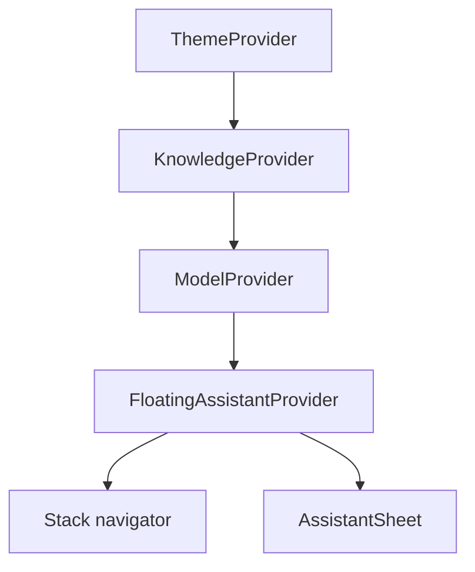
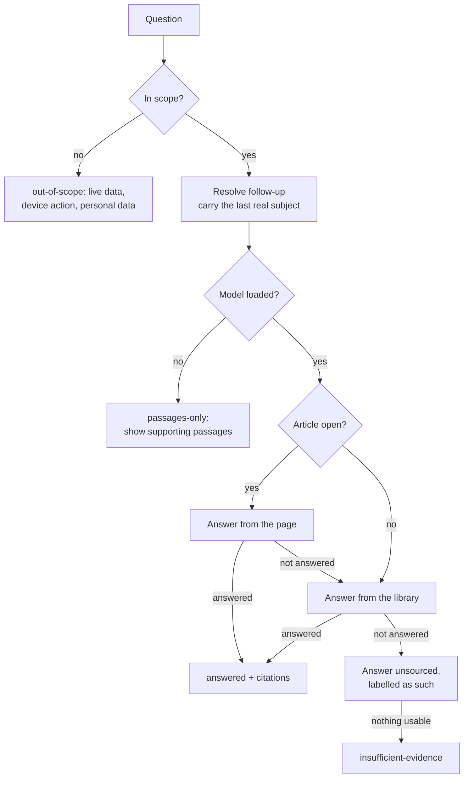

# Seekora: application overview

A single map of the app as it is built today: what it does, which screens exist, how the code is
layered, and how the offline library, the on-device model, and the assistant fit together.

This document describes behaviour that is in the source tree. For which parts have been verified on
hardware, see [IMPLEMENTATION_STATUS.md](IMPLEMENTATION_STATUS.md); for the gaps that remain, see
[KNOWN-LIMITATIONS.md](KNOWN-LIMITATIONS.md).

## What Seekora is

Seekora is an offline-first study app for Android. A reader downloads Wikipedia articles while they
have a connection, reads them later without one, and asks questions about them. Answers come from a
quantised language model that runs on the phone itself, grounded in passages the device already
stores, and every claim links back to the passage it came from.

Nothing is sent to a server to answer a question. The only network calls are deliberate ones the
reader starts: searching Wikipedia, downloading an article, downloading the model, or searching open
academic repositories.

The project was first developed as *AralSearch AI*; that name survives in
[ARALSEARCH_AI_MASTER_BUILD_PROMPT.md](../ARALSEARCH_AI_MASTER_BUILD_PROMPT.md), in some identifiers,
and in the resource User-Agent string.

## At a glance

| | |
| --- | --- |
| Platform | Android (primary), iOS and web build but lack the model and the native overlay |
| Framework | Expo SDK 57, React Native 0.86, React 19, Expo Router |
| Language | TypeScript (strict), `StyleSheet.create` for styling |
| Package manager | Bun (`bun.lock`) |
| Local storage | SQLite with FTS5 (`expo-sqlite`), app-owned document files, AsyncStorage for preferences |
| Inference | `llama.rn` 0.13.0-rc.7 running a Qwen3.5-0.8B Q4\_K\_M GGUF |
| State | Zustand stores for UI and preferences; SQLite for records |
| Android package | `com.kelsz09.myapp` |

Two experiments are on in `app.json`: `typedRoutes` (so route strings are type-checked) and
`reactCompiler`.

## Screens and routes

First launch goes through onboarding. `src/app/(tabs)/_layout.tsx` redirects to `/onboarding` until
the onboarding store reports `completed`, so the tabs are unreachable before setup finishes.

### Tabs

| Tab | Route | What it does |
| --- | --- | --- |
| Home | `(tabs)/index` | Dashboard: hero, an **Ask AI** bar that opens the assistant sheet, cards into Search and Library, a challenge invite, and suggested topic packs |
| Search | `(tabs)/search` | Searches Wikipedia online, filtered by the topics chosen during onboarding, and downloads an article for offline reading |
| Library | `(tabs)/library` | Three shelves: downloaded reading, topic packs, and recently viewed |
| AI | `(tabs)/assistant` | Not a screen. The tab press is intercepted and opens the assistant sheet instead |
| Settings | `(tabs)/settings` | Appearance, language, AI model, floating assistant, storage, privacy, help, and replaying the tour |

The AI tab is unusual on purpose. `tabPress` is cancelled in the tab layout and
`useAssistantSheetStore.openAssistant()` is called, so the assistant opens over whatever the reader
was looking at. `AssistantPage` only exists so the tab has a route to own; if it is ever reached it
opens the sheet and navigates back.

`(tabs)/challenge` is registered with `href: null`, so it has no tab button and is reached from the
dashboard or a pack.

### Stack routes

| Route | Feature | Purpose |
| --- | --- | --- |
| `/onboarding` | `onboarding` | Splash, two intro steps, preferences, model, packs |
| `/setup` | `setup` | Readiness and privacy checklist |
| `/model` | `model-manager` | Download, import, verify, load, test, and remove the local model |
| `/help` | `help` | FAQ, support mail, version, content and model credits |
| `/learn` | `offline-reading` | Topic and pack browsing |
| `/packs` | `knowledge-packs` | Redirects to `/learn` while OpenStax content is hidden |
| `/read/[id]` | `offline-reading` | The offline reader for a downloaded article |
| `/article/[id]` | `search` | An article as seen from search, before or during download |
| `/saved/[id]` | `search` | A saved article |
| `/passage/[chunkId]` | `reader` | One stored passage, opened from a search result or a citation |
| `/pdf/[id]` | `resources` | PDF viewer for an open-access document |
| `/floating-assistant` | `floating-assistant` | Permission and controls for the Android overlay |
| `/import` | `document-import` | Import availability (contract only; see below) |
| `/explore` | `explore` | Preserved Expo template route, outside the product |

Task screens — setup, model, help, import, the floating assistant — slide up from the bottom rather
than pushing in from the side, because they are jobs rather than places.

## Code layout

```text
src/
  app/            Expo Router layouts and thin route files that re-export a feature page
  features/       One directory per domain: *Page.tsx, components/, hooks/, services/, types/
  infrastructure/ Native and platform adapters behind small ports
  shared/         Cross-feature UI, providers, stores, services, constants, i18n, types
modules/          Local Expo modules (Kotlin): floating-assistant, model-files
plugins/          Config plugins (with-model-download)
assets/           Images, fonts, bundled knowledge packs
content/          Generated content sources (OpenStax)
scripts/          Content build, asset optimisation, desktop RAG check
tests/            Bun tests
docs/             This folder
```

The layering rules come from `AGENTS.md` and `.cursor/rules/*.mdc`, and they are load-bearing:

- Route files contain no UI and no data fetching. They re-export a `*Page` from a feature.
- Features never import other features. Anything two features need moves to `shared/`.
- SQL and native inference never appear in a screen. They live behind the ports in
  `infrastructure/`, which features reach through a provider.
- Non-route modules never go under `src/app/`, because they would become accidental routes.

### Features

| Feature | Responsibility |
| --- | --- |
| `home` | Dashboard (`AralHomePage`); the original template `HomePage` is preserved beside it |
| `search` | Wikipedia search, article preview, saved articles |
| `library` | Shelves over downloaded readings, packs, and history |
| `offline-reading` | The reader, the reading shelf, and topic browsing |
| `assistant` | The assistant sheet, chat thread, answer cards, and the grounded-answer hook |
| `floating-assistant` | Android overlay permission and controls |
| `knowledge-challenge` | Multiple-choice quiz runs and results |
| `knowledge-packs` | Installed packs and attribution |
| `model-manager` | The model lifecycle screen |
| `resources` | Federated search across open academic repositories |
| `reader` | Single stored passage with its source details |
| `settings`, `help`, `setup`, `onboarding` | Preferences, FAQ, readiness, first run |
| `document-import` | Availability only; the import pipeline is not built |
| `explore` | Preserved template feature |

### Infrastructure ports

Each port has a native implementation, a web implementation that reports the capability as
unavailable, and — where it matters — a test implementation, so tests exercise the same code the
device runs.

| Port | Native | Web | Tests |
| --- | --- | --- | --- |
| `database/sql-driver.ts` | `create-database.native.ts` (expo-sqlite) | `create-database.ts` (unavailable) | Bun's SQLite via `tests/support` |
| `llm/contracts.ts` | `create-engine.native.ts` → `llama-engine.ts` | `create-engine.ts` (unavailable) | fakes in `tests/` |
| `learning/reading-storage.ts` | `reading-storage.native.ts` (document files) | `reading-storage.web.ts` (IndexedDB) | in-memory |
| `files/contracts.ts` | — | — | — (type-only; import is unbuilt) |

## Runtime composition

`src/app/_layout.tsx` loads Noto Sans, hides the splash screen, and wraps the navigator in three
providers. The order matters: the floating assistant answers through the model, and the model
answers from the library.



`AssistantSheet` is mounted as a sibling of the navigator, which is why the assistant can open over
any screen and keep its conversation across navigation.

**`KnowledgeProvider`** opens exactly one SQLite connection for the life of the app, asserts FTS5 is
compiled in, runs migrations, parses the bundled packs through the same validator an imported pack
would use, and hands a `KnowledgeRepository` to features. A failure is surfaced as either
`unavailable` (no SQLite, as on web) or `error`, never as a silent empty library.

**`ModelProvider`** owns one engine and one storage instance and serialises every operation through a
single `operation` phase, so a load cannot race a generation. Leaving the foreground cancels work and
unloads the model to release memory — except while a download is running, or while the floating
assistant holds `setBackgroundHold(true)`, since it is used while another app is in front.

## The offline library

Knowledge packs are validated JSON (`infrastructure/knowledge/pack-format.ts`), chunked into
passages, and installed into SQLite in one transaction, replacing any earlier version of the same
pack.

Schema version 1 creates `knowledge_packs`, `documents`, and `document_chunks`, plus a `chunks_fts`
FTS5 virtual table over title, heading, and text, tokenised with
`porter unicode61 remove_diacritics 2`. Three triggers keep the index in step with the chunk table.
Migrations are append-only, numbered without gaps, and each one bumps `PRAGMA user_version` inside
its own transaction, so a failed migration leaves the schema untouched. A library written by a newer
schema refuses to open rather than being silently downgraded.

Search returns a `SearchHit` carrying the bm25 `rank` plus `matchedTerms` and `queryTerms`. Hits that
contain more of the query's terms rank first, with bm25 breaking ties. Those two counts are what the
evidence check later depends on.

More detail: [KNOWLEDGE-PACKS.md](KNOWLEDGE-PACKS.md).

## Offline reading

`infrastructure/learning/wikipedia.ts` fetches an article in English or Tagalog, pinned to a
revision. The saved form is a `SavedReading`: summary, sections as heading plus paragraphs, up to
eight figures, a reading-time estimate at 238 words per minute, and the attribution Wikipedia's
licence requires — revision id, `oldid` source URL, history URL, and CC BY-SA 4.0.

A figure is only kept if it carries a licence name, comes from an allowed Wikimedia URL, is at least
240 pixels wide, and weighs under 400 KB; anything else is dropped rather than shown without
attribution. Tables and some formulas are omitted, so an article is a text edition.

`reading-repository.ts` revalidates every field on read as well as on write, so a hand-edited or
truncated file is rejected rather than rendered. A package is capped at 2 MB of JSON and 6 MB
including images, and a save that fails part-way removes what it wrote. Listing reads metadata only,
one article at a time, so a large shelf does not have to fit in memory.

More detail: [OFFLINE-READING.md](OFFLINE-READING.md).

## The on-device model

The model is pinned in `shared/constants/local-model.ts` — repository, filename, git revision, exact
byte size, SHA-256, MD5, and licence. A moving branch is never resolved at runtime.

| | |
| --- | --- |
| Model | `diodel/Qwen3.5-0.8B-Q4_K_M-GGUF`, shown in the app as *Seekora AI* |
| Size | 529,297,312 bytes |
| Licence | Apache-2.0 |
| Runtime | `llama.rn` with a 2048-token context; 1–4000 character prompts, 1–256 output tokens |

Weights are never packaged in the APK. `plugins/with-model-download.js` strips the legacy embedded
asset and adds `ignoreAssetsPatterns.add('!*.gguf')` to the Android resource configuration, so a
stray GGUF cannot inflate a build.

The lifecycle is explicit and always user-initiated: download the pinned file (or import an existing
one), verify size, GGUF version, and SHA-256, then store a `ModelManifest` that records the installed
copy's MD5 for a fast re-check before each load. Loading verifies first, then loads; generation
streams tokens and can be cancelled; unloading releases the context.

More detail: [LOCAL-MODEL.md](LOCAL-MODEL.md).

## Grounded answering

This is the heart of the app. Retrieval decides whether the model is asked at all, the model only
ever sees retrieved passages, and a citation survives only if its passage can still be read back
from local storage.

### The pipeline

`features/assistant/hooks/useGroundedAnswer.ts` orchestrates it; the stages live in
`shared/services/rag/` and `shared/services/ai/`.



**Scope.** `shared/services/ai/scope.ts` names only what the app genuinely cannot do: live data,
actions on the phone, and the reader's private accounts. The patterns deliberately under-match —
a missed case falls through to normal handling and is merely unhelpful, whereas a false positive
refuses a legitimate study question. A "now" word is required, so *how do typhoons form* stays a
knowledge question while *is it raining today* does not.

**Follow-ups.** `rag/follow-up.ts` turns *why?* or *tell me more* into something retrievable by
prefixing the most recent question that actually named a subject. A question with more than two
content terms and no backward reference is always treated as fresh, so *what is slope?* is never
merged into an unrelated thread.

**Evidence.** `retrieveEvidence` fetches six candidates and keeps those containing at least 60% of
the question's content terms. Nothing at all gives `no-match`; matches that are too thin give
`weak-match`. In both cases the model is never asked, so it cannot invent an answer the library
cannot support.

**The yes/no gate.** When the best passage misses part of the question, the model is first asked a
four-token *YES or NO* question — does this passage contain what is needed? A small model answers
that far more reliably than it resists answering a question it cannot support.

**Prompting.** `rag/context-builder.ts` numbers at most three passages, clips each to 900 characters
at a sentence boundary, and keeps the whole prompt under 3600 characters. The sources come *before*
the task, because a small model follows what it read last and text inside a passage cannot override
an instruction that comes after it. The preamble says outright that sources are reference text, not
instructions.

**Generation.** `generateParagraph` stops the model as soon as it starts a second paragraph: small
models tend to repeat themselves once finished, and on a phone every extra token costs time and
battery. A cut-off trailing sentence is trimmed. If the engine rejects the prompt as too long for the
context, the request is retried with fewer passages.

**Citations.** `rag/citations.ts` drops every `[n]` marker that does not point at a supplied source,
then `resolveCitations` re-reads each chunk from SQLite and discards citations whose passage has gone.
If the model cited nothing, the passages it was given are listed instead and `citedByModel` records
the difference, so the UI never implies the model chose a source it did not.

**Repetition.** `shared/services/ai/repetition.ts` compares a reply against earlier answers in the
conversation ignoring case and punctuation. A duplicate is thrown away and asked again with a
rephrase instruction, and the streamed draft is cleared so the reader does not watch a discarded
answer.

### Budgets

| Limit | Value |
| --- | --- |
| Candidates retrieved | 6 |
| Passages sent to the model | 3 |
| Terms a passage must match | 60% of the question's content terms |
| Prompt / passage / question characters | 3600 / 900 / 400 |
| Answer tokens | 192 grounded, 160 unsourced, 4 for the yes/no check |
| Repeat penalty | 1.1 |

### Outcomes

Every ask resolves to exactly one labelled outcome, and the UI renders each differently:
`answered`, `unsourced` (the model's own knowledge, marked as unsupported), `passages-only` (no model
loaded, so the supporting passages are shown without prose), `out-of-scope`,
`insufficient-evidence` (`no-match`, `weak-match`, or `model-declined`), `stopped`, `error`, and
`notice`.

## Assistant surfaces

Two surfaces share one model, one library, and the services above.

**The sheet** (`features/assistant/AssistantSheet.tsx`) is a modal mounted at the root. It keeps a
chat thread, remembers the last six turns so follow-ups resolve, streams tokens as they arrive,
supports voice input through `expo-speech-recognition`, and — when opened over an article — passes
that page in as the first source to try.

**The floating assistant** is an Android overlay drawn by the local Kotlin module in
`modules/floating-assistant/`, bridged through `infrastructure/floating-assistant/native.ts`. It
needs "display over other apps", runs as a foreground service, can attach captured screen text as
context, and holds the model loaded while another app is in front. It reacts to memory pressure by
unloading the model when it is idle. Every overlay string is passed in from the app's own
translations. It is unavailable on web, on iOS, and in any build made before the module existed.

More detail: [FLOATING-ASSISTANT.md](FLOATING-ASSISTANT.md).

## Knowledge Challenge

A quiz over the reader's own material. `shared/services/challenge/` builds a deck, then optionally
asks the model to rewrite a question from the passage the original was built on, using a fixed
`Q: / A) / B) / C) / D) / Correct:` format. The output is parsed strictly, and a question is kept
only if the correct option's content words all appear in the passage — a small model sometimes
answers from memory rather than from what it read, and that answer cannot be trusted. Anything that
fails any check is discarded and the original question stands.

## Open resources

`features/resources/` searches six open repositories in parallel — OpenAlex, arXiv, Europe PMC,
PLOS, Zenodo, and Wikipedia — then deduplicates and normalises the results, enriches them by DOI
through Crossref and Unpaywall, validates download links, and can save an open-access PDF for the
in-app viewer. Requests time out after 12 seconds, arXiv is rate-limited to one call every 3 seconds,
and documents over 80 MB are refused. Setting `EXPO_PUBLIC_CONTACT_EMAIL` joins the providers' polite
pools; it is a public address, never a secret.

This is the one subsystem that is online by nature, and it is kept out of the offline paths.

## Cross-cutting concerns

**Localisation.** `shared/i18n/` holds English and Filipino catalogues with keys typed from the
English dictionary, so a missing or misspelled key fails typecheck. The first launch picks up the
device language (`fil` and `tl` both map to Filipino) and the choice is then persisted.

**Theming.** `shared/constants/theme.ts` defines the palette, spacing, and the Noto Sans faces;
`theme-store` persists system, light, or dark. Screens compose `ThemedView` and `ThemedText` rather
than hard-coded colours. Touch targets are at least 44 points, shared buttons at least 48, and
animations respect the reduced-motion setting.

**State.** Zustand stores under `shared/stores/` hold UI and preference state — onboarding, theme,
the assistant sheet, offline reading, reading history, pack downloads, saved resources, the challenge
deck, and the floating assistant. Those that must survive a restart persist through AsyncStorage with
explicit `partialize` and `merge`, which is also where values saved by older versions get migrated.
Durable records belong in SQLite, not in a store.

**Content flags.** `shared/constants/content-sources.ts` hides a provider without deleting its code
or data. `openStax: false` today, which is why `/packs` redirects to `/learn` and the OpenStax credit
is absent from Help.

## Storage map

| What | Where |
| --- | --- |
| Packs, documents, passages, full-text index | SQLite (`expo-sqlite`), app-private |
| Downloaded articles and figures | App-owned document files on device; IndexedDB on web |
| Model weights and manifest | App-owned storage, provisioned at setup, excluded from the APK |
| Preferences, onboarding, shelves, history | AsyncStorage through persisted Zustand stores |

Nothing leaves the device except when the reader starts a search, a download, or a resource lookup.

## Working on it

```bash
bun install --frozen-lockfile
bun run android     # prebuild, compile, and install a development build
bunx expo start --dev-client   # daily work after the first install
```

Expo Go cannot load `llama.rn`, so on-device answers require a development build. Web is a shell
preview: no library, no model. Full build requirements, the standalone APK recipe, and the JDK and
NDK versions are in the [README](../README.md).

Before calling anything done:

```bash
bunx expo lint
bunx tsc --noEmit
bun test tests
```

After adding a route file, run `bunx expo customize tsconfig.json` or start the dev server so the
typed-route declarations in `.expo/types` pick it up; otherwise `tsc` rejects links to the new route.

The Bun suite covers the RAG pipeline, the repository and its SQL, pack parsing, the model download
and verifier, packaging, resume behaviour, offline reading, reading history, challenge questions, the
floating assistant, and the resource providers. `scripts/rag-desktop-check.mjs` exercises retrieval
and prompting on the desktop, and `tests/resources.live.test.ts` hits the real provider APIs.

### Adding to the app

- **A screen.** Add `features/<name>/<Name>Page.tsx` and a public `index.ts`, then a thin re-export
  at `src/app/<route>.tsx`, and register it in the stack or tabs layout if it needs options.
- **A native capability.** Define the port in `infrastructure/<area>/contracts.ts`, implement
  `*.native.ts`, make the web file report it unavailable, and inject it through a provider.
- **A schema change.** Append a new numbered migration. Never edit a released one.
- **A dependency.** `bunx expo install <pkg>`, so the version matches the SDK. Rebuild the
  development build if it ships native code.

## Related documents

- [ARCHITECTURE.md](ARCHITECTURE.md) — decisions, layering, and the next vertical slice.
- [KNOWLEDGE-PACKS.md](KNOWLEDGE-PACKS.md) — pack format, ranking, evidence, citation rules.
- [LOCAL-MODEL.md](LOCAL-MODEL.md) — checksums, packaging, runtime validation.
- [OFFLINE-READING.md](OFFLINE-READING.md) — reading architecture, limits, device checks.
- [FLOATING-ASSISTANT.md](FLOATING-ASSISTANT.md) — the overlay, permissions, privacy, test steps.
- [IMPLEMENTATION_STATUS.md](IMPLEMENTATION_STATUS.md) — what has been verified, and how.
- [KNOWN-LIMITATIONS.md](KNOWN-LIMITATIONS.md) and [OFFLINE-TEST.md](OFFLINE-TEST.md) — acceptance.
- [CONTENT-LICENSES.md](CONTENT-LICENSES.md) — content and model licences.
